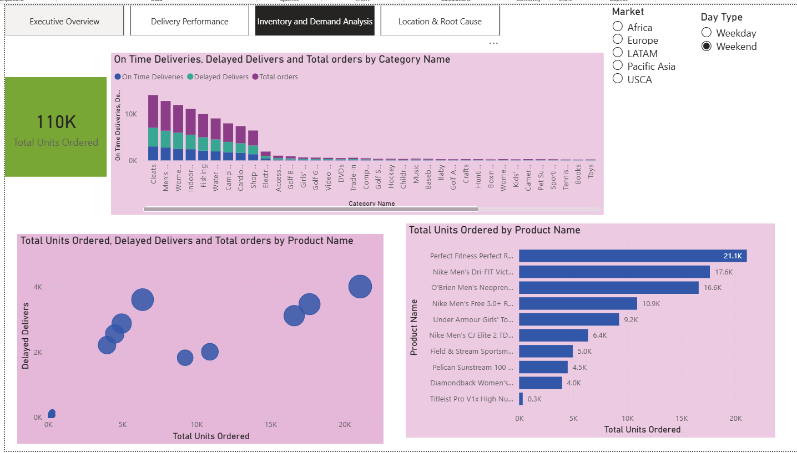

# powerbi-supply-chain-analytics
End-to-end Power BI dashboard for supply chain delivery, demand, and location analysis
# End-to-End Supply Chain Analytics Dashboard (Power BI)

## 📌 Project Overview
This project presents an end-to-end **Power BI dashboard** designed to analyze supply chain performance across **delivery reliability, demand patterns, and geographic root causes**.

The dashboard is built to support **executive and operational decision-making** by transforming raw supply chain data into actionable insights using **Power Query and DAX**.

---

## 🎯 Business Objectives
The dashboard aims to answer key supply chain questions such as:
- Are deliveries meeting service-level expectations?
- Where and when do delivery delays occur?
- Which products and categories drive the highest demand?
- Are delays concentrated in specific locations or markets?

---

## 🗂️ Data Source
- **Dataset:** DataCo Smart Supply Chain Dataset (Public)
- **Source:** Kaggle  
- **Description:**  
  The dataset simulates real-world ERP-style supply chain data and includes information on orders, shipping, products, customers, and geographic locations.

---

## 🛠️ Tools & Skills Used
- **Power BI Desktop**
- **Power Query** – data cleaning and transformation
- **DAX** – KPI and measure creation
- **Supply Chain KPI Design**
- **Dashboard Storytelling & Visualization**

---

## 📊 Dashboard Pages

### 1️⃣ Executive Overview
High-level KPIs and trends to assess overall delivery health and operational risk.
- On-Time Delivery %
- Average Delivery Delay (Days)
- Late Delivery Risk %
- Total Orders
- Performance trend over time

---

### 2️⃣ Delivery Performance
Focused analysis of delivery reliability and delay drivers.
- On-Time vs Delayed deliveries by Shipping Mode
- Top countries contributing to delivery delays
- Comparison of delivery performance across markets

---

### 3️⃣ Inventory & Demand
Demand-side analysis using order quantity as a proxy for inventory stress.
- Top products by units ordered
- Orders by product category
- Demand vs delay relationship at product level

---

### 4️⃣ Location & Root Cause
Geographic and regional analysis to identify where corrective action is needed.
- Top countries by delayed deliveries
- Market-level delay comparison
- On-Time vs Delayed delivery distribution by location

---

## 📸 Dashboard Preview

### Executive Overview

### Delivery Performance

### Inventory & Demand

### Location & Root Cause

---

## 🔍 Key Insights
- Delivery delays are concentrated in a small number of countries and shipping modes
- Certain high-demand products experience higher operational stress
- Weekday vs weekend patterns indicate differences in delivery performance
- Geographic concentration of delays highlights targeted improvement opportunities

---

## 💼 Business Impact
This dashboard enables supply chain teams to:
- Monitor delivery reliability using executive-level KPIs
- Identify high-impact delay drivers quickly
- Support demand planning and operational prioritization
- Focus improvement efforts on critical products and locations

---

## 🚀 Future Enhancements
- Add SLA-based delivery thresholds
- Integrate inventory stock-level data
- Extend analysis with demand forecasting models

---

## 📎 Notes
This project is intended for **portfolio and learning purposes**, demonstrating practical supply chain analytics and Power BI dashboard design.
